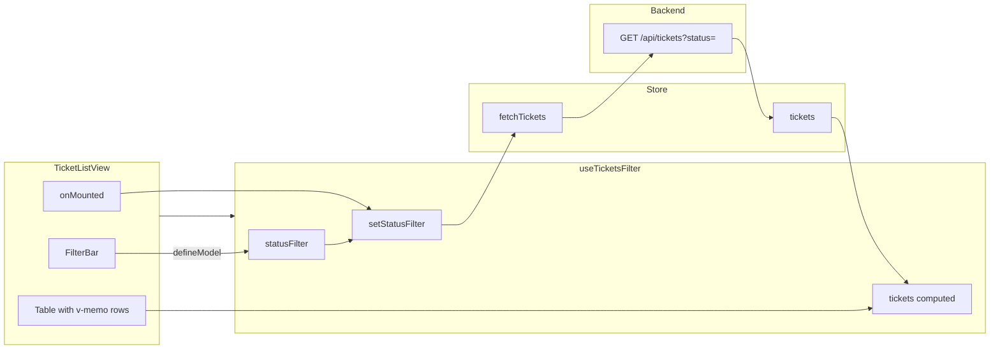

# TicketListView – plan implementacji

## Cel

Wdrożyć `frontend/src/modules/tickets/views/TicketListView.vue`: lista zgłoszeń z filtrem, ładowaniem, stanem pustym i nawigacją do szczegółów, z użyciem lifecycle hooks, `defineModel`, `v-once`, `v-memo` i `<TransitionGroup>`.

## Zależności (istniejące)

- **Backend:** `backend/src/modules/tickets/services/getTickets.ts` – przyjmuje `query.status` (i limit, offset, search) i zwraca przefiltrowaną listę. Frontend wywołuje `GET /api/tickets?status=...`.
- **Store:** `frontend/src/modules/tickets/stores/ticketsStore.ts` – `fetchTickets(params?: { status?: TTicketStatus })`, `loading`, `tickets`. Lista = to, co zwrócił backend (bez client-side filtrowania).
- **Typy:** `frontend/src/modules/tickets/types/index.ts` – `ITicket`, `TStatusFilter` (`"all" | "new" | "in_progress" | "closed"`).
- **i18n:** klucze w `frontend/src/locales/pl.json`: `tickets.headers.list`, `tickets.filter.*`, `tickets.messages.loading`, `tickets.messages.emptyList`.
- **Router:** trasa `ticket-detail` z `params: { id }`.

Brakujące: composable do filtra, komponenty UI z **shadcn-vue** (tak jak istniejący Button), oraz cienkie komponenty modułowe (FilterBar, StatusBadge) zbudowane na shadcn.

### Komponenty shadcn-vue (wymagane w tym widoku)

- **Select** – dropdown filtra statusu w FilterBar (opcje: Wszystkie, Nowe, W trakcie, Zamknięte).
- **Badge** – etykieta statusu w tabeli (warianty/kolory: new, in_progress, closed).
- **Table** – tabela listy zgłoszeń (TableRoot, TableHeader, TableBody, TableRow, TableCell).
- **Card** – karty zgłoszeń na mobile (TicketCard).

Jeśli któregoś brakuje w projekcie, dodać z rejestru @shadcn:

```bash
npx shadcn-vue@latest add select badge table card
```

---

## 1. Store – uproszczenie (filtrowanie tylko w backendzie)

**Plik:** `frontend/src/modules/tickets/stores/ticketsStore.ts`.

- **Usunąć** getter `getTicketsFilteredByStatus` – lista zgłoszeń to wyłącznie `store.tickets` (wynik ostatniego `fetchTickets(params)`). Backend zwraca już przefiltrowane dane.
- Zostawić: `tickets`, `loading`, `fetchTickets(params?)`, `getTicketById`, `updateTicketStatus`.
- Ewentualnie getter `getFilteredTickets` zwracający `state.tickets` tylko dla zgodności z opisem zadania.

---

## 2. Composable: useTicketsFilter (reakcja na backend)

**Plik:** `frontend/src/modules/tickets/composables/useTicketsFilter.ts` (nowy).

- `statusFilter`: `ref<TStatusFilter>('all')`.
- `setStatusFilter(value: TStatusFilter): void` – ustawia `statusFilter.value = value` i wywołuje `store.fetchTickets(value === 'all' ? undefined : { status: value })`.
- **Albo** w composable `watch(statusFilter, ...)` → fetchTickets przy zmianie. Pierwsza load: w widoku `onMounted` wywołać `store.fetchTickets()` lub `setStatusFilter('all')`.
- `tickets`: `computed<ITicket[]>(() => store.tickets)`.
- Wewnątrz: `const store = useTicketsStore()`.

---

## 3. Komponent FilterBar (z defineModel + shadcn Select)

**Plik:** `frontend/src/modules/tickets/components/FilterBar.vue` (nowy).

- **Model:** `defineModel<TStatusFilter>()`, domyślna wartość `'all'`.
- **Opcje filtra:** stała `['all', 'new', 'in_progress', 'closed']`; etykiety przez `$t('tickets.filter.all')` itd.
- **UI:** shadcn **Select** – SelectTrigger, SelectContent, SelectItem dla każdej opcji. Wartość powiązana z defineModel.
- Bez logiki biznesowej – tylko prezentacja i v-model.

Użycie w widoku: `<FilterBar v-model="statusFilter" />`.

---

## 4. StatusBadge (shadcn Badge)

**Plik:** `frontend/src/modules/tickets/components/StatusBadge.vue`.

- **Props:** `status: TTicketStatus`.
- **UI:** shadcn **Badge** – mapowanie status → wariant (new → niebieski, in_progress → pomarańczowy, closed → zielony). Tekst: `$t('tickets.status.' + status)`.
- Kolory można oprzeć o zmienne Sass z `_variables.scss`.

Reużywalny w liście i w szczegółach zgłoszenia.

---

## 5. TicketListView – struktura i techniki

**Plik:** `frontend/src/modules/tickets/views/TicketListView.vue`.

### Lifecycle

- **onMounted:** pierwsza load listy z aktualnym filtrem – np. `setStatusFilter(statusFilter.value)` lub `store.fetchTickets()`.

### Stan i composable

- `useTicketsStore()` → `loading`, `tickets`.
- `useTicketsFilter()` → `statusFilter`, `setStatusFilter`, `tickets`.
- `useIsMobile()` → `isMobile` (ref) – do przełączania Table / karty na mobile.
- Nawigacja: `useRouter()` + `router.push({ name: 'ticket-detail', params: { id: String(ticket.id) } })` przy kliku.

### Szablon

- **v-once:** na nagłówku listy, np. `<h1 v-once>{{ $t('tickets.headers.list') }}</h1>`.
- **FilterBar:** `<FilterBar v-model="statusFilter" />`.
- **Loading:** `v-if="store.loading"` – komunikat i18n; `v-else` – filter + lista lub pusty stan.
- **Pusty stan:** `v-if="tickets.length === 0"` – komunikat z i18n.
- **Desktop:** shadcn **Table** – v-for po `tickets`, v-memo na wierszach `[ticket.id, ticket.status]`, klik → router. Kolumny: ID, customerName, subject, status (StatusBadge), priority.
- **Mobile:** `v-if="isMobile"` – lista **TicketCard** zamiast tabeli; każda karta klikalna → `/ticket/:id`.
- Opcjonalnie **TransitionGroup** z klasami `.list-*` (enter/leave/move).

---

## 6. Przepływ danych (backend jako źródło listy)



---

## 7. Kolejność wdrożenia

1. **Shadcn:** jeśli brak – dodać Select, Badge, Table, Card: `npx shadcn-vue@latest add select badge table card`. Sprawdzić ścieżki w `frontend/src/shared/components/ui/`.
2. **Sass (zgodnie z task.txt):** dodać `_variables.scss` (np. w `frontend/src/styles/`): kolory statusów `$status-new`, `$status-in-progress`, `$status-closed`, breakpoint `$breakpoint-mobile: 768px`; opcjonalnie `_mixins.scss` z `@mixin mobile`. Zaimportować w głównym CSS/SCSS.
3. **Store:** usunąć getter `getTicketsFilteredByStatus` z `ticketsStore.ts`. Ewentualnie getter `getFilteredTickets` zwracający `state.tickets`.
4. **useTicketsFilter:** ref `statusFilter`, `setStatusFilter`, `tickets` = computed z store. Opcjonalnie watch(statusFilter) → fetchTickets.
5. **useIsMobile (responsywność):** composable zwracający `isMobile` (ref), np. `window.matchMedia` lub @vueuse/core.
6. **FilterBar.vue** – shadcn Select + defineModel, opcje z i18n (`tickets.filter.*`).
7. **StatusBadge.vue** – shadcn Badge + mapowanie status → wariant/kolory (można oprzeć o zmienne Sass), etykieta z i18n (`tickets.status.*`).
8. **TicketCard.vue (mobile):** karta pojedynczego zgłoszenia (shadcn Card); props `ticket`; te same pola co wiersz tabeli; klik → router do `/ticket/:id`.
9. **TicketListView:** onMounted, v-once na tytule, FilterBar (v-model), loading / pusty stan. Desktop: Table z v-memo. Mobile: lista TicketCard. Opcjonalnie TransitionGroup.
10. **TicketDetailView (osobna faza):** pełna implementacja – wszystkie pola, Select statusu, Zapisz, Powrót do listy. Weryfikacja seeda backendu: 8–10 zgłoszeń.

---

## 8. Uwagi

- Backend: filtr statusu w `fetchTickets({ status })`; backend zwraca przefiltrowaną listę (DRY).
- v-memo: dependency `[ticket.id, ticket.status]` – re-render wiersza tylko gdy zmieni się ten ticket.
- defineModel: FilterBar wystawia v-model; watch na statusFilter lub setStatusFilter wywołuje fetchTickets.
- onMounted – pierwsze pobranie listy z aktualnym filtrem.

---

## 9. Zgodność z treścią zadania (task.txt)

| Wymaganie w task.txt | W planie |
|----------------------|----------|
| **Sass** (zmienne, zagnieżdżanie, kolory statusów) | Krok 2: `_variables.scss`, breakpoint; użycie w StatusBadge / SCSS. |
| **Responsywność: table → karty na mobile** | Kroki 5, 8, 9: useIsMobile, TicketCard, w TicketListView Table vs lista kart. |
| **Szczegóły zgłoszenia (/ticket/:id)** – pełne pola, Select statusu, Zapisz, Powrót | Krok 10: osobna faza TicketDetailView. |
| **Getter „filtrowane zgłoszenia”** | Spełnione przez `store.tickets` po `fetchTickets({ status })`; opcjonalnie getter `getFilteredTickets`. |
| **Dane: min. 8–10 zgłoszeń** | Weryfikacja seeda backendu w fazie TicketDetailView. |

---

## Od czego zaczynamy

**Start: krok 1 – komponenty Shadcn**

Najpierw uzupełniamy UI z rejestru shadcn-vue (Select, Badge, Table, Card), żeby FilterBar, StatusBadge, tabela i karty na mobile mogły z nich korzystać.

1. Wejść w katalog frontendu: `cd frontend`.
2. Dodać komponenty (jeśli któregoś brakuje):  
   `npx shadcn-vue@latest add select badge table card`
3. Sprawdzić, że w `frontend/src/shared/components/ui/` są katalogi/pliki: select, badge, table, card.

Potem kolejno: krok 2 (Sass), 3 (store), 4 (useTicketsFilter), 5 (useIsMobile), 6–9 (FilterBar, StatusBadge, TicketCard, TicketListView). Faza TicketDetailView (krok 10) na końcu.
